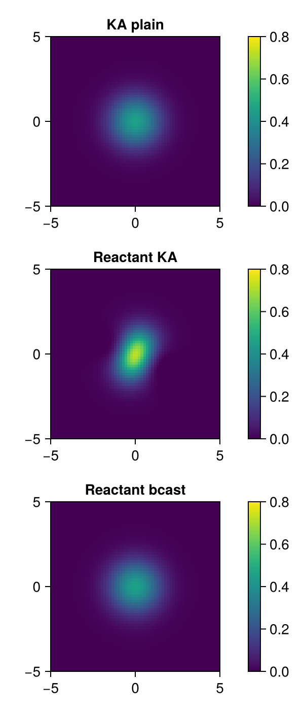

# 2D Diffusion with Reactant.jl

Benchmarks and correctness checks for [`diff2D_flux.jl`](diff2D_flux.jl), running three flavours of 2D diffusion on a Grace CPU and an H100 GPU:
- **KA plain** — straightforward KernelAbstractions.jl kernels
- **Reactant KA** — KA kernels compiled through Reactant.jl (`@compile`)
- **Reactant bcast** — broadcast-style stencil compiled through Reactant.jl

## Correctness issue

The middle panel (Reactant KA) produces wrong values and an asymmetric diffusion pattern, visible in the heatmap comparison below.

```julia
res = 64
runme(; nx=res, ny=res, nt=50, use_cuda=true)
```



> **Note:** KA plain and Reactant bcast agree; Reactant KA yields incorrect, asymmetric results.

## Performance

```julia
res = 16 * 1024
runme(; nx=res, ny=res, nt=10, use_cuda=true)
```

CUDA GPU (H100), `nx = ny = 16384`, `nt = 10`:

| Backend        | Teff (GB/s) |
|----------------|------------:|
| KA plain       |     3190.74 |
| Reactant KA    |     1669.99 |
| Reactant bcast |     2948.19 |

KA plain reaches peak measured throughput. Reactant bcast is close (~92 %), while Reactant KA currently sits at ~53 %, likely related to the same compilation issue causing the correctness problem above.
